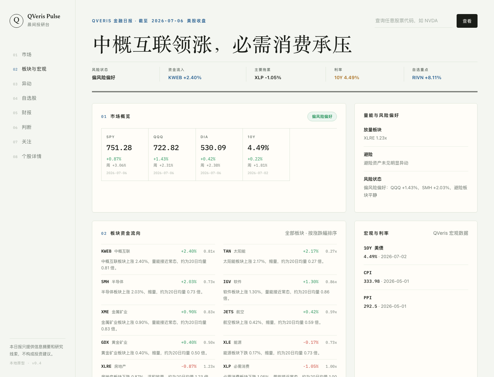
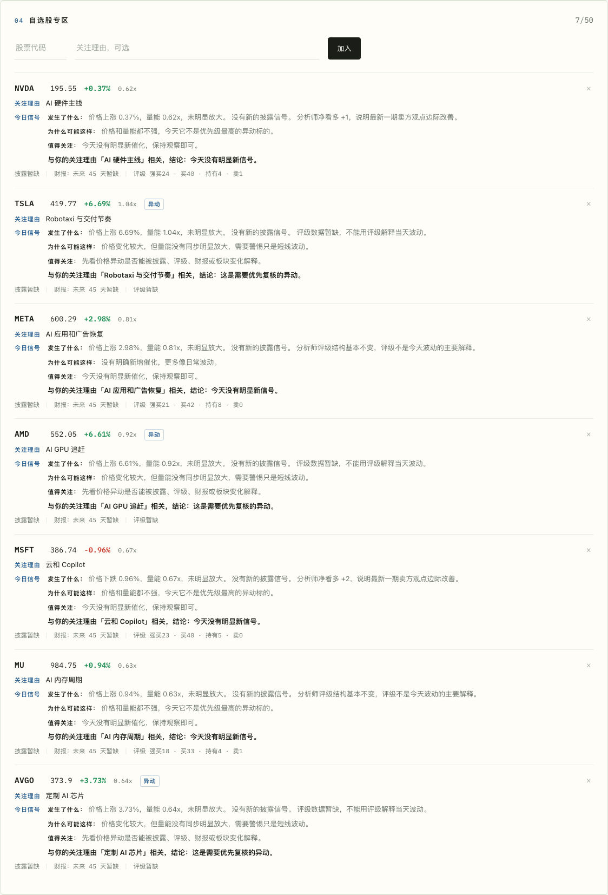
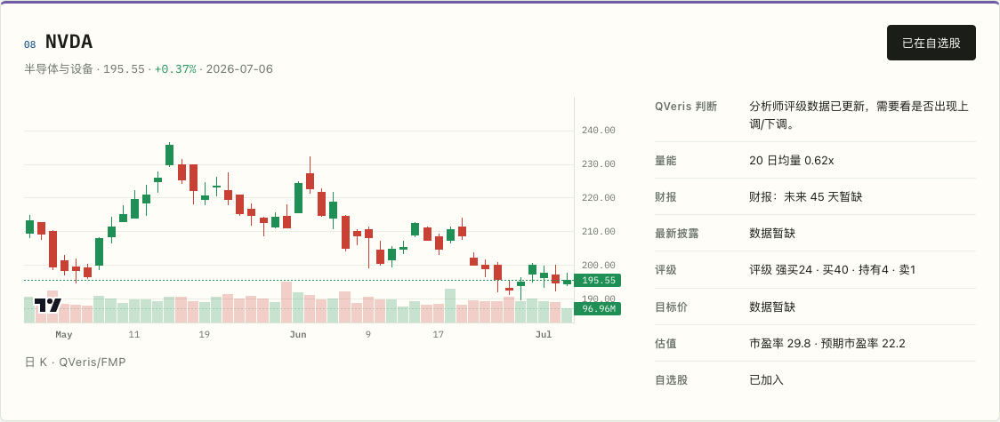

# QVeris Pulse

一个本地优先的美股晨间投研台。QVeris Pulse 用 QVeris 拉取行情、历史 K 线、板块 ETF、财报日历、公开披露、评级和宏观数据，再生成一页可浏览的日报。

> 仅用于信息整理和研究线索，不构成投资建议。

## 为什么做

每天早上不想在新闻流、行情页和披露网站之间来回切。QVeris Pulse 的目标是把「昨晚发生了什么」「自选股有什么变化」「今天该复核什么」压缩到一页。

## 界面预览







## 功能

- 市场概览：SPY、QQQ、DIA、10Y 美债。
- 板块资金流向：半导体、软件、能源、黄金矿业、航空等 ETF 的涨跌幅和量能。
- 今日明星个股：从内置美股 universe 中筛选上涨/下跌异动。
- 自选股专区：本地添加 watchlist 和关注理由，刷新后会传给日报 API。
- 未来 45 天财报：按自选股过滤 QVeris 财报日历，显示 EPS/收入预期和关注点。
- QVeris 判断：结构化行情、披露、财报、评级、宏观数据聚合后的中文总结。
- 今日关注清单：把异动、披露、财报变成待复核任务。
- 个股详情：搜索任意 ticker，查看日 K、量能、披露、财报、评级、估值。

## 数据源

本项目只接入 QVeris 作为金融数据源：

- QVeris EODHD quote：延迟行情和基础估值。
- QVeris FMP historical：OHLCV 历史行情和 K 线。
- QVeris FMP filings：公开披露。
- QVeris Finnhub earnings：财报日历。
- QVeris Finnhub recommendation：分析师评级趋势。
- QVeris Twelve Data price target：个股详情页目标价。
- QVeris FRED observations：10Y 美债、CPI、PPI 等宏观数据。

DeepSeek 只用于可选的中文总结增强。没有 DeepSeek key 时，后端会使用结构化规则生成 QVeris 判断。

## 申请 Key

### QVeris

1. 打开 [QVeris](https://qveris.ai/) 并注册账号。
2. 进入 Dashboard / API Keys 获取 API key。QVeris 官方文档说明 SDK/环境变量读取 `QVERIS_API_KEY`。
3. 本项目通过 QVeris REST tool execute 接口调用工具。

参考：
- [QVeris Documentation](https://qveris.ai/docs)
- [QVeris Python SDK Authentication](https://qveris.ai/docs/python-sdk)
- [QVeris REST API Reference](https://qveris.ai/docs/rest-api)

### DeepSeek 可选

1. 打开 [DeepSeek Platform](https://platform.deepseek.com/)。
2. 在 [API Keys](https://platform.deepseek.com/api_keys) 创建 key。
3. DeepSeek API 兼容 OpenAI Chat Completions 格式，本项目使用 `OPENAI_API_KEY`、`OPENAI_BASE_URL`、`OPENAI_MODEL` 三个变量接入。

参考：
- [DeepSeek API Docs](https://api-docs.deepseek.com/)
- [DeepSeek API Authentication](https://api-docs.deepseek.com/api/deepseek-api)

## 本地启动

需要 Node.js 18+，不需要安装 npm 依赖。

```bash
git clone https://github.com/AlexLiu0130/qveris-pulse.git
cd qveris-pulse
cp .env.example .env
```

编辑 `.env`：

```bash
QVERIS_API_KEY=

# 可选：启用 DeepSeek 生成更完整的中文判断
OPENAI_API_KEY=
OPENAI_BASE_URL=https://api.deepseek.com
OPENAI_MODEL=deepseek-chat
```

把等号后面替换成你自己的 key。不要把 `.env` 提交到 GitHub。

启动：

```bash
npm start
```

打开：

```text
http://localhost:4173
```

检查语法：

```bash
npm run check
```

## API

```text
GET /api/reports/daily
GET /api/reports/daily?symbols=NVDA,TSLA,MU
GET /api/market/overview
GET /api/market/sectors
GET /api/tickers/NVDA
```

日报接口会返回 `qverisUsage`，用于估算本次生成调用了多少次 QVeris tool：

```json
{
  "toolCalls": 99,
  "estimatedCredits": 99,
  "note": "按每次 QVeris tool execute 约 1 credit 估算；实际扣费以 QVeris 后台为准。缓存命中不计入本次数。"
}
```

## 费用和缓存

- 冷启动生成一份默认日报，当前大约 90-110 次 QVeris tool call，主要来自历史行情。
- 同一进程内有内存缓存，刷新同一份日报通常不会重复消耗同等调用量。
- 实际积分/计费以 QVeris 后台为准。

## 开源注意

- 不要提交 `.env`。
- `.env.example` 只放变量名，不放真实 key。
- 项目不会自动读取父目录或其他项目的 `.env`。
- 外部请求设置了默认 15 秒超时，可用 `REQUEST_TIMEOUT_MS` 调整。

## 项目结构

```text
09_watchlist_pulse/
  app/
    index.html
    styles.css
    app.js
  docs/
  .env.example
  .gitignore
  README.md
  server.js
```

## 当前限制

- 本地内存缓存，重启后会重新请求 QVeris。
- Watchlist 存在浏览器 localStorage，不是云端账户系统。
- 日报 universe 是内置列表，不是全市场扫描。
- 新闻模块已移除，当前只保留行情、财报、披露、评级、宏观。
