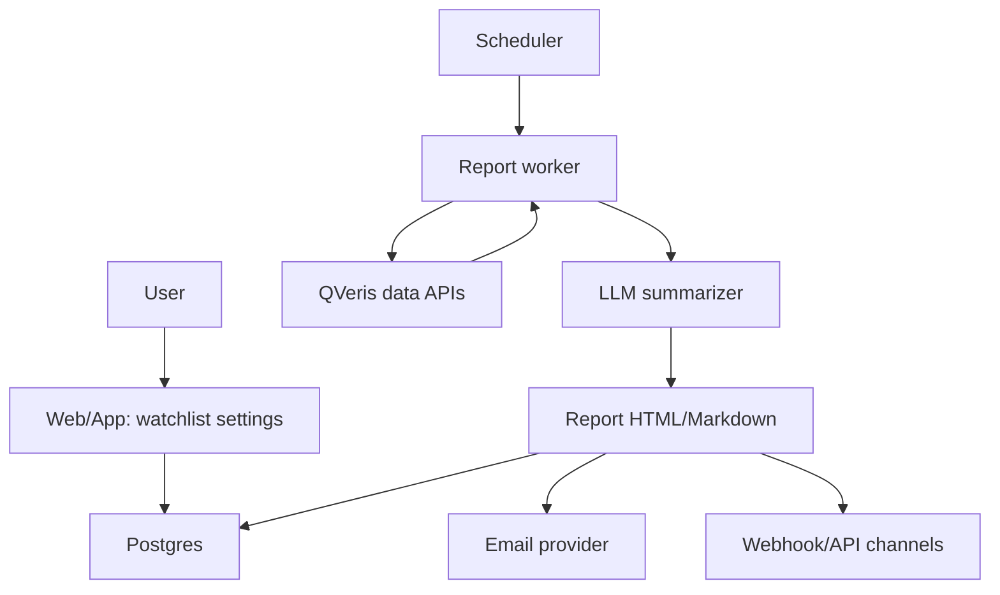

# Architecture

## 最小架构



## 后端模块

```text
app/
  api/
    watchlists      create/read/update/delete tickers
    reports         read generated reports
    webhooks        channel delivery config
  jobs/
    daily_report    trading-day morning report
    weekly_report   weekend report
  services/
    market_data     quote/news/filing/earnings/analyst adapters
    report_builder  ranking, filtering, prompt input
    delivery        email/webhook senders
```

## 数据表

```text
users
  id, email, plan, timezone, created_at

watchlists
  id, user_id, name, created_at

watchlist_items
  id, watchlist_id, ticker, thesis, position, created_at

reports
  id, user_id, type, period_start, period_end, subject, body_html, body_md, created_at

report_events
  id, report_id, ticker, event_type, severity, title, source_url, created_at

delivery_channels
  id, user_id, type, config_json, enabled, created_at
```

## 日报生成流程

1. 找到当天需要生成日报的用户。
2. 读取用户 watchlist 和 thesis。
3. 批量拉取 ticker 数据：价格、成交量、新闻、filing、评级、财报日历。
4. 规则层先筛选信号：异常波动、重要 filing、新评级、财报倒计时、与 thesis 冲突的信息。
5. LLM 把结构化信号压缩成日报。
6. 保存报告，再推送邮件或 webhook。

## 信号排序规则

| 权重 | 信号 |
|---|---|
| 5 | 财报今日/明日、重大 filing、重大指引变化 |
| 4 | 大幅跳空、成交量异常、评级上调/下调 |
| 3 | 管理层/产品/监管/诉讼新闻 |
| 2 | 行业联动、同业变化 |
| 1 | 普通新闻、重复报道 |

## LLM 边界

- LLM 不算价格变化，不判断事实真假。
- LLM 只做排序解释、压缩表达、生成用户可读文本。
- 所有数字和来源必须来自结构化数据。
- 没有来源的判断不进报告。

## API 草案

```http
POST /api/watchlists
PATCH /api/watchlists/:id/items
GET /api/reports?type=daily
POST /api/delivery-channels
POST /api/reports/:id/test-send
```

